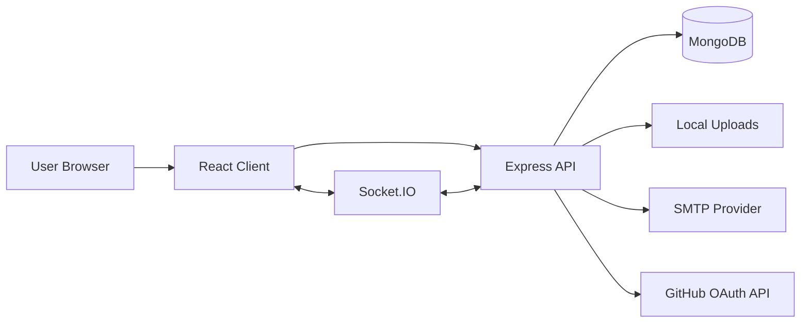
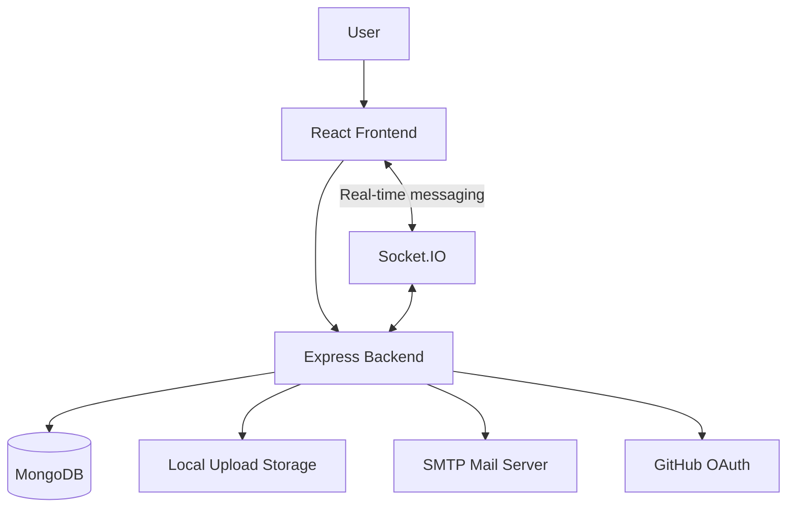
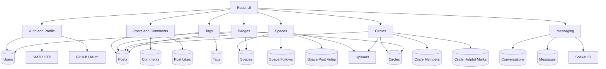
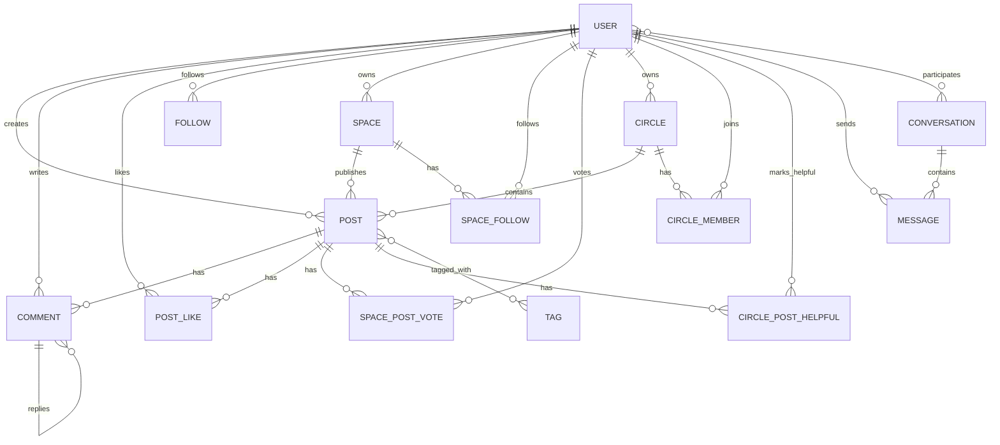
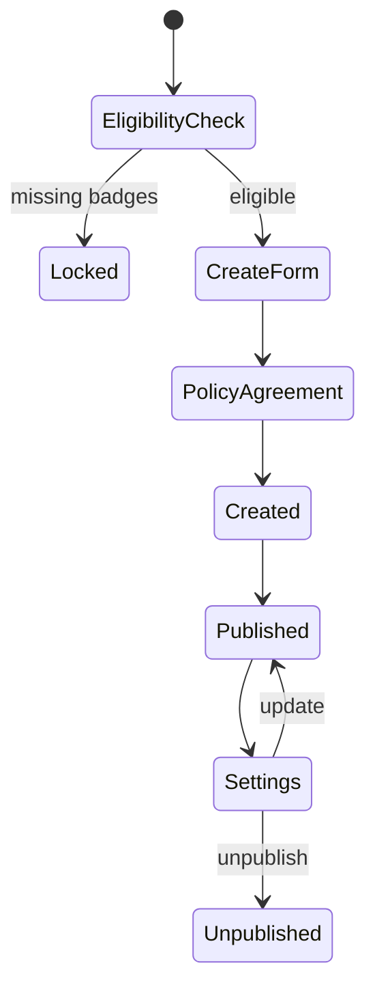
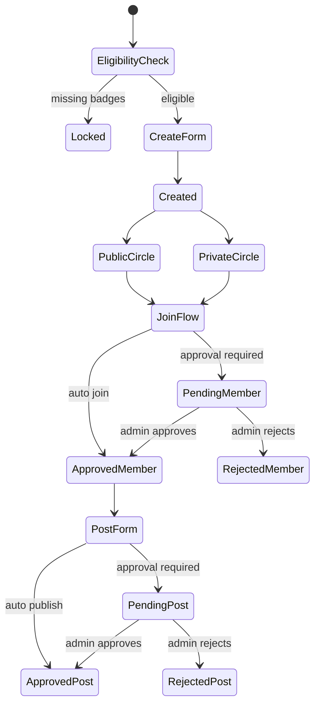
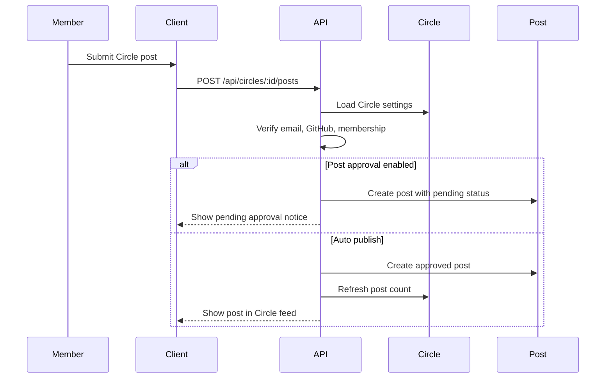
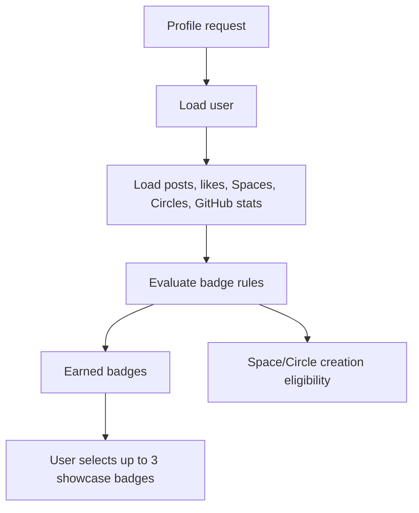

# DevSpace Project Report

## 1. Executive Summary

DevSpace is a developer-focused social media application built with the MERN stack. It supports normal social posting, comments and replies, likes, user profiles, real-time messaging, developer verification, badges, and two community formats: Spaces and Circles.

The product direction is centered on developer identity, trust, and technical discussion. Normal posts work like a personal timeline. Spaces work like public developer pages where only the Space owner can publish. Circles work like discussion groups where approved members can participate, subject to Circle privacy and moderation settings.

Core implemented features include:

- JWT authentication, profile management, and protected routes
- Normal posts with likes, comments, replies, tags, search, sorting, and pagination
- Email OTP verification and GitHub OAuth developer verification
- Badge system with showcase badges and feature eligibility rules
- Spaces with owner-only posts, followers, voting, images, links, and settings
- Circles with membership, public/private mode, join approval, post approval, member list, admin review queue, member removal, and Helpful marks
- Real-time private messaging through Socket.IO
- Markdown-supported post and comment content
- Discovery panels for top tags, top Spaces, top Circles, top posts, and users
- Profile community management for created Spaces and Circles
- Independent desktop column scrolling and responsive navigation
- Basic safety controls such as profanity filtering, posting cooldowns, comment rate limiting, upload validation, and auth checks

DevSpace is now more than a timeline application. It provides developer credibility through badges, page-style publishing through Spaces, and member-led discussion communities through Circles.

## 2. Technology Stack

| Layer | Technology |
| --- | --- |
| Frontend | React |
| Backend | Node.js, Express.js |
| Database | MongoDB with Mongoose |
| Authentication | JWT |
| Real-time Messaging | Socket.IO |
| File Uploads | Multer, local `/uploads` folder |
| Email Verification | Nodemailer OTP |
| Developer Verification | GitHub OAuth |
| Password Security | Bcrypt |
| Content Safety | bad-words profanity filtering |
| Styling | Material UI, CSS |
| Routing | React Router |
| Markdown | React Markdown |

## 3. High-Level Architecture

DevSpace uses a React client, an Express API, MongoDB persistence through Mongoose, local upload storage, SMTP email delivery, GitHub OAuth integration, and Socket.IO for real-time messaging.

Main API namespaces:

- `/api/users`
- `/api/posts`
- `/api/comments`
- `/api/tags`
- `/api/messages`
- `/api/spaces`
- `/api/circles`

## 4. Implemented Features

### 4.1 Authentication and Profiles

Users can register, log in, and access authenticated features through JWT tokens. The profile page is the central place for user identity, activity, badges, and community management.

Implemented profile capabilities:

- User profile view
- Bio editing
- Profile tabs for posts, liked posts, and comments
- Follow and unfollow users
- Message button for private conversations
- Badge panel and showcase badge selection
- Email verification action
- GitHub connection action
- Community card with Create Space and Create Circle actions
- My Spaces list
- My Circles list

The login page includes a show/hide password button.

### 4.2 Normal Posts, Comments, and Replies

Normal posts are user-authored posts in the main feed. Creating a normal post now requires email verification.

Implemented post capabilities:

- Create, read, update, and delete normal posts
- Email-verified-only normal post creation
- Like and unlike normal posts
- Liked-post history on profiles
- Like preview modal
- Commenting and nested replies
- Comment edit and delete
- Markdown rendering for post and comment content
- Main feed, profile feed, liked feed, tag feed, and search feed
- Search by post title
- Sort by latest, earliest, likes, and comments
- Paginated Load More behavior

Interaction model by post type:

| Post Type | Engagement Model |
| --- | --- |
| User post | Likes |
| Space post | Upvotes/downvotes |
| Circle post | Helpful marks |

### 4.3 Tags

Tags are extracted automatically from hashtags in post titles and content.

Implemented tag capabilities:

- Automatic hashtag extraction
- Up to 10 tags per post
- Tag records with post counts
- Top Tags discovery panel
- Tag-click feed filtering
- Tag counts in the UI

### 4.4 Spaces

Spaces are page-style developer communities. A Space has its own identity and content stream, but only the Space owner can create posts inside it.

Implemented Space capabilities:

- Create Space from profile community card
- Badge-gated Space creation
- Space route at `/spaces/:slug`
- Name, slug, avatar, banner, about text, specialization, and up to two links
- Follow and unfollow Spaces
- Owner-only Space posts
- Owner-only settings
- Soft unpublish
- Top Spaces discovery and search
- Space-specific Top Posts panel
- Space posts in post/tag feeds
- Space posts use voting, not likes

Space creation requires:

- Verified User badge
- Developer badge
- At least one additional earned badge
- Required name, about, specialization, avatar, banner, and policy agreement

### 4.5 Space Voting

Space posts use upvotes and downvotes. Normal likes are rejected for Space posts.

Voting rules:

- One vote per user per Space post
- User can switch vote value
- User can remove vote
- `voteScore = upvoteCount - downvoteCount`
- `impressionCount = upvoteCount + downvoteCount`
- Space totals are recalculated from Space post voting activity

### 4.6 Circles

Circles are discussion-focused communities. Unlike Spaces, Circle posts can be created by approved members, not only the admin. Circles are stack-based and include membership and moderation settings.

Implemented Circle capabilities:

- Create Circle from profile community card
- Circle route at `/circles/:slug`
- Badge-gated Circle creation using the same eligibility as Spaces
- Required Circle name, short description, tech stack, banner image, mode, settings, and policy checkbox
- Public or private mode
- Optional admin approval for new members
- Optional admin approval for member posts
- Creator-only admin model for v1
- Join, cancel request, and leave behavior
- Member list
- Admin can approve/reject join requests
- Admin can approve/reject pending posts
- Admin can kick members
- Circle posts can be pending, approved, or rejected
- Circle posts use Helpful marks instead of likes or votes
- Top Circles discovery and search by name or stack
- Circle-specific Top Posts panel ranked by Helpful count
- Profile lists created Circles beside created Spaces

Circle posting requires:

- User is logged in
- User has verified email
- User has connected GitHub
- User is an approved Circle member

Circle visibility rules:

| Circle Mode | Non-member Access |
| --- | --- |
| Public | Can view approved posts |
| Private | Can view basic Circle information only |

Private Circle posts and member lists are hidden from non-members. Approved public Circle posts can appear in the main home feed. Pending, rejected, and private Circle posts are excluded from public feeds.

### 4.7 Circle Helpful Marks

Circle posts use Helpful marks to support discussion quality without introducing downvotes.

Helpful rules:

- Only approved Circle members can mark a Circle post as Helpful.
- One Helpful mark per user per Circle post.
- Helpful marks can be removed.
- Circle and post Helpful totals update after changes.
- Top posts inside a Circle are ranked by Helpful count.

### 4.8 Badges

Badges communicate trust, progress, and eligibility. Badge state is calculated dynamically from user activity and account verification fields.

Implemented badge capabilities:

- Badge definitions with descriptions
- Earned and locked badge states
- Email verification badge action
- GitHub developer badge action
- Showcase badge selection
- Maximum of 3 showcased badges
- Badges displayed beside usernames
- Badge-gated Space and Circle creation

Current badge rules:

| Badge | Unlock Rule |
| --- | --- |
| Verified User | Verify email through OTP |
| Developer | Connect GitHub account |
| Author | Publish 10 normal user posts |
| Helpful Voice | Receive 50 likes across normal posts |
| Starter | Publish 1 normal user post |
| Builder | Publish 25 normal user posts |
| Trusted Member | Verify email and connect GitHub |
| Space Founder | Create at least 1 Space |
| Circle Admin | Create at least 1 Circle |
| Circle Contributor | Publish 5 approved Circle posts |
| Community Builder | Gain 25 followers across Spaces |
| Rising Space | Reach 100 impressions across Spaces |
| Open Source | Connect GitHub with at least one public repository |
| Popular Project | Connect GitHub with repositories that have stars |

### 4.9 Email OTP Verification

Email verification uses OTP codes.

Implemented OTP behavior:

- User requests verification code
- Server generates and stores OTP hash and expiry metadata
- OTP has a 10-minute expiry
- Repeated send requests are rate-limited
- Failed attempts are counted
- Successful confirmation sets `emailVerified`
- Verified users earn the Verified User badge

### 4.10 GitHub OAuth Verification

GitHub OAuth verifies developer identity and stores lightweight GitHub stats.

Implemented GitHub behavior:

- User starts GitHub connection from profile badges
- Backend redirects to GitHub OAuth
- Callback exchanges code for access token
- Backend reads GitHub profile and repository data
- User account stores GitHub username, public repo count, and total stars
- Connected users earn the Developer badge
- Public repo and star data unlock Open Source and Popular Project badges

### 4.11 Messaging

Messaging uses conversations, messages, and Socket.IO.

Implemented messaging capabilities:

- Conversation records
- Message records
- Sender/receiver relationships
- Real-time message delivery support
- Messenger route protected by authentication

### 4.12 Search, Discovery, and Navigation

Implemented discovery surfaces:

- Landing page for logged-out visitors
- Main authenticated feed
- Global post search
- Search results page
- User search and random user discovery
- Top Posts panel
- Top Tags panel
- Top Spaces panel
- Top Circles panel
- Space search by name or specialization
- Circle search by name or stack
- Responsive navbar with search
- Independent desktop scrolling for left rail, middle feed, and right rail

Top Posts is context-aware:

- Global pages show top liked normal posts
- Space pages show top posts from that Space
- Circle pages show top posts from that Circle

## 5. Data Flow Diagrams

### 5.1 Level 0 DFD

### 5.2 Level 1 DFD

## 6. Entity Relationship Diagram

## 7. Model Summary

| Model | Responsibility |
| --- | --- |
| User | Account, profile, verification, GitHub stats, showcase badges |
| Post | User posts, Space posts, and Circle posts |
| Comment | Comments and nested replies |
| PostLike | Likes for normal user posts |
| Tag | Hashtag records and post counts |
| Space | Page-style developer community data |
| SpaceFollow | Space follower records |
| SpacePostVote | Upvote/downvote records for Space posts |
| Circle | Discussion community data and settings |
| CircleMember | Circle membership and join request status |
| CirclePostHelpful | Helpful marks for Circle posts |
| Follow | User-to-user follow records |
| Conversation | Messaging conversation |
| Message | Chat message |

Important `Post` fields now include:

- `postType`: `user`, `space`, or `circle`
- `space`: linked Space for Space posts
- `circle`: linked Circle for Circle posts
- `status`: `approved`, `pending`, or `rejected`
- `likeCount`: normal posts
- `upvoteCount`, `downvoteCount`, `voteScore`, `impressionCount`: Space posts
- `helpfulCount`: Circle posts

## 8. Important Feature Logic

### 8.1 Space Lifecycle

Space access rules:

- Owner can post and edit settings.
- Visitors can read, follow, and vote.
- Unpublished Spaces are hidden from public discovery and feeds.

### 8.2 Circle Lifecycle

Circle access rules:

- Creator is the only Circle admin in v1.
- Admin can update settings, approve members, approve posts, and kick members.
- Approved members can post, comment, and mark posts Helpful.
- Private Circle content is hidden from non-members.

### 8.3 Circle Post Flow

### 8.4 Badge Evaluation

Badge rules are dynamically calculated from account and activity state rather than manually awarded.

## 9. API Overview

### 9.1 Space APIs

| Method | Endpoint | Purpose |
| --- | --- | --- |
| POST | `/api/spaces` | Create a Space |
| GET | `/api/spaces` | List Spaces |
| GET | `/api/spaces/top` | Get top Spaces |
| GET | `/api/spaces/search` | Search Spaces |
| GET | `/api/spaces/:slug` | Get Space by slug |
| PATCH | `/api/spaces/:id` | Update Space settings |
| DELETE | `/api/spaces/:id` | Soft-unpublish Space |
| POST | `/api/spaces/:id/follow` | Follow Space |
| DELETE | `/api/spaces/:id/follow` | Unfollow Space |
| POST | `/api/spaces/:id/posts` | Create Space post |

### 9.2 Circle APIs

| Method | Endpoint | Purpose |
| --- | --- | --- |
| POST | `/api/circles` | Create a Circle |
| GET | `/api/circles` | List Circles |
| GET | `/api/circles/top` | Get top Circles |
| GET | `/api/circles/search` | Search Circles |
| GET | `/api/circles/:slug` | Get Circle by slug |
| PATCH | `/api/circles/:id` | Update Circle settings |
| POST | `/api/circles/:id/join` | Join or request to join |
| DELETE | `/api/circles/:id/join` | Leave or cancel request |
| POST | `/api/circles/:id/members/:memberId/approve` | Approve join request |
| POST | `/api/circles/:id/members/:memberId/reject` | Reject join request |
| DELETE | `/api/circles/:id/members/:memberId` | Kick member |
| POST | `/api/circles/:id/posts` | Create Circle post |
| POST | `/api/circles/:id/posts/:postId/approve` | Approve pending post |
| POST | `/api/circles/:id/posts/:postId/reject` | Reject pending post |
| POST | `/api/circles/posts/:postId/helpful` | Mark Circle post Helpful |
| DELETE | `/api/circles/posts/:postId/helpful` | Remove Helpful mark |

### 9.3 Post APIs

| Method | Endpoint | Purpose |
| --- | --- | --- |
| GET | `/api/posts` | Main feed |
| POST | `/api/posts` | Create normal user post |
| GET | `/api/posts/:id` | Get single post |
| PATCH | `/api/posts/:id` | Update post |
| DELETE | `/api/posts/:id` | Delete post |
| GET | `/api/posts?space=slug` | Get posts from a Space |
| GET | `/api/posts?circle=slug` | Get posts from a Circle |
| GET | `/api/posts?search=value` | Search posts |
| GET | `/api/posts?tag=value` | Filter by tag |
| POST | `/api/posts/like/:id` | Like normal post |
| DELETE | `/api/posts/like/:id` | Unlike normal post |
| GET | `/api/posts/liked/:id` | Get liked posts |
| GET | `/api/posts/like/:postId/users` | Get users who liked a post |
| POST | `/api/posts/:id/vote` | Vote on Space post |
| DELETE | `/api/posts/:id/vote` | Remove Space vote |

### 9.4 User, Verification, Comment, Tag, and Messaging APIs

| Method | Endpoint | Purpose |
| --- | --- | --- |
| POST | `/api/users/register` | Register |
| POST | `/api/users/login` | Log in |
| GET | `/api/users/random` | Random or searched users |
| GET | `/api/users/:username` | Profile, posts, Spaces, Circles, badge state |
| PATCH | `/api/users/:id` | Update bio |
| POST | `/api/users/follow/:id` | Follow user |
| DELETE | `/api/users/unfollow/:id` | Unfollow user |
| PATCH | `/api/users/badges/showcase` | Update showcase badges |
| POST | `/api/users/email-verification/send` | Send OTP |
| POST | `/api/users/email-verification/confirm` | Confirm OTP |
| GET | `/api/users/github/connect` | Start GitHub OAuth |
| GET | `/api/users/github/callback` | GitHub OAuth callback |
| POST | `/api/comments/:id` | Create comment/reply |
| GET | `/api/comments/post/:id` | Get post comments |
| PATCH | `/api/comments/:id` | Update comment |
| DELETE | `/api/comments/:id` | Delete comment |
| GET | `/api/tags` | Top tags |
| GET | `/api/messages` | Conversations |
| POST | `/api/messages/:id` | Send message |
| GET | `/api/messages/:id` | Conversation messages |

## 10. Security and Validation

Implemented controls:

- JWT-protected routes for authenticated actions
- Bcrypt password hashing
- Email verification required for normal post creation
- Email verification, GitHub connection, and approved membership required for Circle posting
- Circle commenting and Helpful marks require approved membership
- Space posting restricted to Space owner
- Space settings restricted to owner or app admin
- Circle settings and moderation restricted to Circle owner or app admin
- Duplicate Space and Circle slugs are rejected
- Private Circle content is hidden from non-members
- Pending and rejected Circle posts are excluded from public feeds
- Normal post creation cooldown
- Comment rate limiting and cooldown
- Profanity filtering on user and community text fields
- Markdown rendering skips raw HTML and disallows Markdown images
- Uploads accept JPG, PNG, and WebP only
- Upload size limited to 5 MB
- OTP expiry, resend cooldown, and attempt limits

Production reminders:

- Do not commit real `.env` secrets.
- Use strong `TOKEN_KEY` values.
- Configure SMTP and GitHub OAuth credentials.
- Move uploads to cloud storage for production.
- Add broader API rate limiting.
- Add reporting and admin moderation workflows.

## 11. Environment Configuration

Required environment groups:

| Group | Variables |
| --- | --- |
| Database | `MONGO_URI` |
| Auth | `TOKEN_KEY` |
| Server | `PORT` |
| Client URL | `CLIENT_URL` |
| GitHub OAuth | `GITHUB_CLIENT_ID`, `GITHUB_CLIENT_SECRET`, `GITHUB_CALLBACK_URL` |
| SMTP | `SMTP_HOST`, `SMTP_PORT`, `SMTP_SECURE`, `SMTP_USER`, `SMTP_PASS`, `SMTP_FROM` |

The report intentionally does not include secret values.

## 12. Testing Checklist

Core account and profile:

- User can register and log in.
- Password is stored hashed.
- Logged-out users see the landing page.
- Logged-in users see the feed.
- Profile tabs show posts, liked posts, and comments.
- Profile community card shows Spaces and Circles.
- Eligible owner can open Create Space and Create Circle from profile.
- Login password visibility toggle works.

Posts and comments:

- Unverified user cannot create normal posts.
- Verified user can create normal posts.
- Normal posts can be liked/unliked.
- Liked posts appear in profile Liked tab.
- Comments and replies work.
- Circle post comments require approved Circle membership.
- Markdown renders correctly.
- Tags are extracted from titles and content.
- Search, sorting, and Load More work.

Spaces:

- Space creation is locked until badge eligibility is met.
- Eligible user can create a Space.
- Duplicate Space slug is rejected.
- Owner sees Space composer and settings.
- Visitor does not see Space composer/settings.
- User can follow/unfollow Space.
- Space posts use votes and reject likes.
- Vote switching and removal update counts.
- Space-specific Top Posts shows only that Space's posts.
- Unpublished Space is hidden from public areas.

Circles:

- Circle creation is locked until badge eligibility is met.
- Eligible user can create a Circle with required banner and policy checkbox.
- Public Circle is visible and readable by non-members.
- Private Circle hides posts and member list from non-members.
- Auto-join Circle immediately approves membership.
- Approval-required Circle creates a pending join request.
- Admin can approve/reject join requests.
- Admin can kick members.
- Circle posting requires email verification, GitHub connection, and approved membership.
- Post approval setting creates pending posts.
- Admin can approve/reject pending posts.
- Approved public Circle posts appear in the main feed.
- Private, pending, and rejected Circle posts do not appear in public feeds.
- Helpful marks work for approved members only.
- Circle-specific Top Posts ranks Circle posts by Helpful count.
- Top Circles ranks by member count and post count.

Verification and badges:

- User can request and confirm email OTP.
- Invalid and expired OTPs are rejected.
- GitHub connection updates GitHub fields.
- Badges unlock from real activity.
- Circle Admin and Circle Contributor badges unlock correctly.
- Showcase badge selection remains limited to 3.

Messaging and layout:

- Messaging still works after feature additions.
- Left rail, middle feed, and right rail scroll independently on desktop.
- Mobile layout remains usable.

## 13. Future Improvements

Recommended next improvements:

- Add automated backend tests for Space and Circle permissions.
- Add frontend tests for Circle creation, join flows, moderation, and Helpful marks.
- Add notification system for comments, follows, join approvals, post approvals, and badge unlocks.
- Add reporting and admin moderation dashboard.
- Add invite flow and multiple moderator roles for Circles.
- Add richer Circle discussion features such as solved answers or reaction types.
- Add cloud upload storage such as S3 or Cloudinary.
- Add production-grade API rate limiting.
- Add analytics dashboards for Space and Circle admins.
- Add recommendation feed based on tags, memberships, Helpful marks, votes, and follows.

## 14. Conclusion

DevSpace is now a full-stack developer social platform with three complementary content modes: personal posts, owner-published Spaces, and member-led Circles. The badge system connects identity, trust, and feature eligibility. Email verification and GitHub OAuth strengthen account credibility. Spaces support branded page-style publishing, while Circles support moderated technical discussion.

The project is suitable as a strong V1/V2 portfolio-level MERN application. The next major step should be production hardening: automated tests, stronger rate limiting, content reporting, cloud uploads, and more complete moderation workflows.
